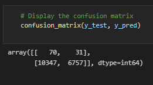

# Credit_Risk_Analysis
## Overview
The purpose of this analysis is to use a variety of techniques to evaluate and predict credit risk using a dataset from Lendingclub.

## Results
### Resampling Models
#### Random OverSampler
- **Accuracy Score:** 0.6463970560994359


- **Confusion Matrix:** 
``` 
array([[  72,   29],
         [7185, 9919]], dtype=int64)                               
```


- **Imbalanced Classification Report:**
```
                   pre       rec       spe        f1       geo       iba       sup

  high_risk       0.01      0.71      0.58      0.02      0.64      0.42       101
   low_risk       1.00      0.58      0.71      0.73      0.64      0.41     17104

avg / total       0.99      0.58      0.71      0.73      0.64      0.41     17205
```


#### SMOTE
- **Accuracy Score:**  0.6361059077142514


- **Confusion Matrix:** 
```
array([[   69,    32],
       [ 7029, 10075]], dtype=int64)
```


- **Imbalanced Classification Report:**
```
                   pre       rec       spe        f1       geo       iba       sup

  high_risk       0.01      0.68      0.59      0.02      0.63      0.41       101
   low_risk       1.00      0.59      0.68      0.74      0.63      0.40     17104

avg / total       0.99      0.59      0.68      0.74      0.63      0.40     17205
```


#### Cluster Centroids

- **Accuracy Score:** 0.544061547759079


- **Confusion Matrix:** 
```
array([[   70,    31],
       [10347,  6757]], dtype=int64)
```



- **Imbalanced Classification Report:**
```
                   pre       rec       spe        f1       geo       iba       sup

  high_risk       0.01      0.69      0.40      0.01      0.52      0.28       101
   low_risk       1.00      0.40      0.69      0.57      0.52      0.27     17104

avg / total       0.99      0.40      0.69      0.56      0.52      0.27     17205
```


### Predicting Credit Risk using SMOTEEN
- **Accuracy Score:** 0.6361059077142514


- **Confusion Matrix:** 
```
array([[   69,    32],
       [ 7029, 10075]], dtype=int64)
```


- **Imbalanced Classification Report:**
```
                   pre       rec       spe        f1       geo       iba       sup

  high_risk       0.01      0.68      0.59      0.02      0.63      0.41       101
   low_risk       1.00      0.59      0.68      0.74      0.63      0.40     17104

avg / total       0.99      0.59      0.68      0.74      0.63      0.40     17205
```


### Using Ensemble Classifiers to Predict Credit Risk
#### Balanced Random Forest Classifier
- **Accuracy Score:** 0.7885466545953005


- **Confusion Matrix:** 
```
array([[   71,    30],
       [ 2153, 14951]], dtype=int64)
```


- **Imbalanced Classification Report:**
```
                   pre       rec       spe        f1       geo       iba       sup

  high_risk       0.03      0.70      0.87      0.06      0.78      0.60       101
   low_risk       1.00      0.87      0.70      0.93      0.78      0.62     17104

avg / total       0.99      0.87      0.70      0.93      0.78      0.62     17205
```


- **Feature sorting by importance:**


#### Easy Ensemble Classifier
- **Accuracy Score:** 0.9316600714093861


- **Confusion Matrix:** 
```
array([[   93,     8],
       [  983, 16121]], dtype=int64)
```


- **Imbalanced Classification Report:**
```
                   pre       rec       spe        f1       geo       iba       sup

  high_risk       0.09      0.92      0.94      0.16      0.93      0.87       101
   low_risk       1.00      0.94      0.92      0.97      0.93      0.87     17104

avg / total       0.99      0.94      0.92      0.97      0.93      0.87     17205
```


## Summary
Summary: Summarize the results of the machine learning models, and include a recommendation on the model to use, if any. If you do not recommend any of the models, justify your reasoning.
There is a summary of the results (2 pt)
There is a recommendation on which model to use, or there is no recommendation with a justification (3 pt)
